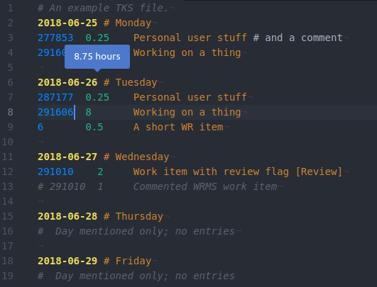

# WRMS for Atom

Primarily a WRMS timesheet plugin for Atom.

I'll be honest - this isn't *much* better than [what you'll see in vim](misc/vim-example.png) out of the box on a Catalyst laptop ... yet 😉

## TODO

See Gitlab https://gitlab.wgtn.cat-it.co.nz/chrisburgess/atom-wrms/issues

## References

* [Building your first Atom plugin](https://blog.github.com/2016-08-19-building-your-first-atom-plugin/)
* [Atom Flight Manual: Theme](http://flight-manual.atom.io/hacking-atom/sections/creating-a-theme/#creating-a-theme)
* [Atom Flight Manual: Grammar](https://flight-manual.atom.io/hacking-atom/sections/creating-a-grammar/)
* [A guide to writing a language grammar in Atom](https://gist.github.com/Aerijo/b8c82d647db783187804e86fa0a604a1)
* [atom-language-crontab](https://github.com/aegypius/atom-language-crontab/) for an example of how to highlight columns

## Notes

* Git merge conflict UI is quite nice - how it inserts coloured blocks
